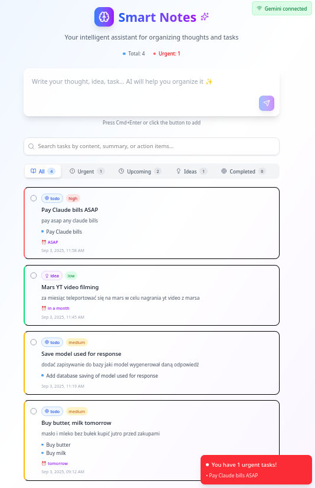
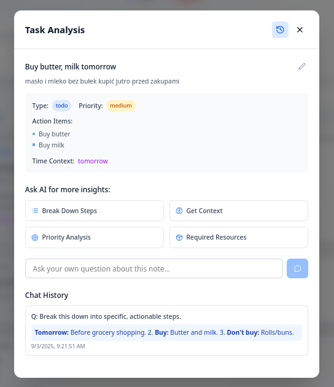

# Smart Notes

A modern, AI-powered note-taking application that automatically analyzes and organizes your thoughts with intelligent task prioritization.



<details>
<summary>Screenshot - Example Task</summary>


</details>

## Features

### Core Functionality
- **Smart Note Analysis**: Automatically categorizes notes into todos, reminders, ideas, and important items
- **Priority Intelligence**: AI assigns priority levels (low, medium, high) based on content context
- **Task Management**: Built-in completion tracking and action item extraction
- **Real-time Processing**: Instant AI analysis as you type
- **Persistent Storage**: Local browser storage with IndexedDB

### AI Integration
- **Multiple AI Providers**: Support for both Ollama and Google Gemini
- **Flexible Configuration**: Easy switching between AI providers
- **Smart Parsing**: Advanced JSON parsing with fallback mechanisms
- **Context-Aware**: AI understands due dates, urgency, and task relationships

### User Experience
- **Modern Interface**: Clean, responsive design with gradient backgrounds
- **Urgent Task Alerts**: Real-time notifications for high-priority items
- **Detailed Task View**: Expandable modals with full note analysis
- **Connection Status**: Live monitoring of AI service connectivity
- **Search Functionality**: Quick task filtering and search
- **Data Backup/Export**: Full export/import functionality for notes and settings

## Technology Stack

- **Frontend**: React 19.1.1 with TypeScript
- **Build Tool**: Vite 7.1.4
- **Styling**: Tailwind CSS 4.1.12
- **Icons**: Lucide React
- **Markdown**: React Markdown with GitHub Flavored Markdown support
- **Code Highlighting**: Shiki syntax highlighter
- **Storage**: IndexedDB via idb-keyval
- **Code Quality**: Biome for linting and formatting

## Getting Started

### Prerequisites
- Node.js (version 18 or higher)
- npm or yarn package manager

### Installation

1. Clone the repository:
```bash
git clone https://github.com/skorotkiewicz/smart-notes
cd smart-notes
```

2. Install dependencies:
```bash
npm install
```

3. Start the development server:
```bash
npm run dev
```

4. Open your browser and navigate to `http://localhost:5173`

### AI Configuration

#### Using Ollama (Local AI)
1. Install and run Ollama locally
2. Pull a compatible model (e.g., `llama2`, `mistral`)
3. Configure the connection in the app settings:
   - URL: `http://localhost:11434`
   - Model: Your preferred model name

#### Using Google Gemini
1. Obtain a Gemini API key from Google AI Studio
2. Configure in the app settings:
   - API Key: Your Gemini API key
   - Model: `gemini-1.5-flash` (recommended)

## Available Scripts

- `npm run dev` - Start development server
- `npm run build` - Build for production
- `npm run preview` - Preview production build

## Project Structure

```
src/
├── components/          # React components
│   ├── CodeBlock/      # Syntax highlighting
│   ├── ConfigModal.tsx # AI configuration
│   ├── ConnectionStatus.tsx
│   ├── Header.tsx
│   ├── NoteCard.tsx
│   ├── NoteInput.tsx
│   ├── NotesList.tsx
│   └── TaskDetailModal.tsx
├── hooks/              # Custom React hooks
│   └── useNotes.tsx    # Note management logic
├── services/           # External service integrations
│   ├── ai.ts           # AI service abstraction
│   ├── config.ts       # Configuration management
│   ├── exportImport.ts # Data export/import functionality
│   ├── gemini.ts       # Google Gemini integration
│   ├── ollama.ts       # Ollama integration
│   └── storage.ts      # Local storage utilities
├── utils/              # Utility functions
│   ├── jsonParser.ts   # JSON parsing helpers
│   └── prompts.ts      # AI prompt templates
├── types.ts            # TypeScript definitions
├── App.tsx             # Main application component
└── main.tsx            # Application entry point
```

## Contributing

1. Fork the repository
2. Create a feature branch (`git checkout -b feature/amazing-feature`)
3. Commit your changes (`git commit -m 'Add amazing feature'`)
4. Push to the branch (`git push origin feature/amazing-feature`)
5. Open a Pull Request

## License

MIT

## Troubleshooting

### AI Connection Issues
- Ensure your AI service (Ollama/Gemini) is running and accessible
- Check API keys and endpoint URLs in the configuration
- Verify network connectivity and firewall settings

### Performance Considerations
- The app stores data locally in IndexedDB
- Clear browser storage if experiencing issues
- Large numbers of notes may impact performance

### Browser Compatibility
- Modern browsers with ES2020+ support required
- IndexedDB support necessary for data persistence

---

## Data Management

### Backup and Export
1. Click the settings icon (⚙️) in the connection status bar
2. Navigate to the "Data Management" section
3. Click "Export Data" to download a JSON file containing:
   - All your notes and their AI analyses
   - Current configuration settings
4. The file will be named `smart-notes-backup-YYYY-MM-DD.json`

### Restore from Backup
1. Open the settings modal and go to "Data Management"
2. Click "Import Data" and select your backup file
3. Confirm to replace your current data
4. The page will reload automatically to apply changes

**Note**: Import will completely replace all existing notes and settings with the backup data.